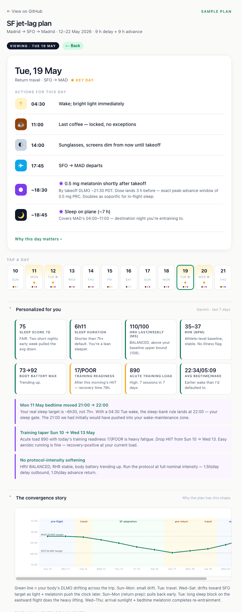

# Jet-lag protocol — Cowork plugin

A circadian phase-shift planner for crossing time zones. Pulls your wearable data, asks four targeted questions about the trip, and generates a personalized day-by-day plan plus an interactive HTML chart.

Built from primary sleep-medicine literature. Every numeric constant in the algorithm traces back to a specific paper.

**Foundational** (the framework): Khalsa 2003 (light PRC) · Burgess 2010 (0.5 mg melatonin PRC) · Burke 2015 (caffeine) · Borbély 1982 (two-process sleep model) · Burgess 2014 + Kantermann 2015 (DLMO from chronotype) · St Hilaire 2012 (1 h light pulse PRC) · Burgess 2008 (3 mg melatonin PRC) · Zeitzer 2000 (light dose-response).

**Current standard** (post-2015 updates): **Brown et al. 2022** (melanopic EDI light prescription — replaces lux as the field metric) · **Phillips et al. 2019** (individual variability in light sensitivity — 50× spread) · **Roach & Sargent 2019** (current synthesis review of jet-lag interventions, replaces Eastman & Burgess 2009 as primary operational reference) · **Chinoy et al. 2021** (consumer-wearable validation — drives R10's relative-baseline approach).

## What the output looks like

  

<em>The sample plan, with the highest-leverage day (Tue 19 — return travel) tapped open. Top: focus card with the day's actions and rationales. Middle: 12-day horizon strip (tap any day to inspect). Bottom: collapsed-by-default disclosures expand to show your Garmin context, the DLMO convergence chart, and the methodology sources.</em>

You can poke at a live sanitized sample at [`sample/sample-trip.html`](sample/sample-trip.html).

## What's inside

A single skill — `jet-lag-protocol` — that fires whenever you mention an upcoming flight ≥3 time zones away.

### Two-pass flow

**Pass 1 — Consultation (always asks first, never skipped):**

1. Reads the algorithm rules (`references/algorithm-rules.md`) and primary literature index (`references/science.md`).
2. Pulls last-7-days data from any connected wearable (Garmin, Apple Watch, Oura, Whoop, Withings) and applies sleep-quality modulation.
3. Asks four clarifying questions via `AskUserQuestion`:
   - Must-be-sharp moments at destination (presentations, board meetings, etc.)
   - Hard constraints during the trip (virtual meetings on home TZ, alcohol, summit overlaps)
   - Substances and health (caffeine OK / melatonin OK / meds / illness)
   - How many hours per day you're willing to shift pre-flight (0 / 0.5 / 1 / 1.5)
4. Drafts the plan as plain markdown in chat.
5. Waits for confirmation.

**Pass 2 — Polished output (only after confirmation):**

1. Saves a markdown plan file to your outputs folder.
2. Saves a polished HTML file built from `templates/plan-template.html` with your trip's data injected.
3. Publishes the HTML to drophere (or another sharing platform) and returns the URL.
4. Renders the chronotherapy chart inline via `show_widget`.

### The HTML output

V7 design — one focus card showing today's actions, a 12-day horizon strip below it, and three collapsible disclosures (Garmin context · high-leverage moments · methodology and sources). Tap any day in the horizon to inspect it. Built mobile-first, light theme.

## Algorithm rules

13 numbered rules in `references/algorithm-rules.md`, each tagged to citations. Highlights:

- **R1**: phase markers (DLMO, CBT_min) from chronotype + bedtime
- **R3**: adaptation rates — 1.5 h/day delay (westward), 1.0 h/day advance (eastward)
- **R4**: four-tier light intensity model (strong-seek / mild-seek / soft-avoid / full-avoid) — discretization of Zeitzer 2000 sigmoid
- **R5**: light windows pinned to CBT_min — peak-delay 2–5h before, peak-advance 2–5h after
- **R6**: 0.5 mg melatonin PRC — peak advance 2–4 h before DLMO
- **R7**: caffeine cutoffs — 8 h before bed for advances, 6 h for delays
- **R8.1**: sleep-bank rule — pre-flight bedtime overrides the protocol drift if logistics demand an early wake
- **R10**: wearable-driven intensity modulation
- **R11**: short-trip skip (<3h shift, <3 nights → stay on home time)
- **R13**: slow caffeine metabolizer extension

Plus an explicit **parameter quarantine** section at the bottom of `algorithm-rules.md` listing every numerical default that's based on N=1 or estimation rather than firm data.

## Design constraints

- **Calendar and wearable data don't replace consultation.** They show schedule and recovery state, not priority or constraints. The four questions extract a layer of information that does not live in any data source.
- **The skill never assumes melatonin or caffeine availability** — both require explicit user opt-in per trip.
- **Drophere publishing is default-on** (the user owns their drophere instance; published URLs are personal).

## Install

Drag-drop the [`.plugin` file from the latest release](https://github.com/Wolbyworld/jet-lag-protocol/releases) onto Cowork. The skill auto-registers. On the next session, mention an upcoming flight ≥3 time zones away and it'll trigger.

## ⚠ Not medical advice

**This plugin is a behavioral and lifestyle planning tool, not a medical device or clinical decision aid.** It produces suggestions about light exposure, sleep timing, caffeine, and over-the-counter melatonin, derived from published circadian-rhythm research. The output is a starting point for a healthy adult traveler — *not* personalized medical guidance.

Specifically:

- **Melatonin recommendations** are based on the 0.5 mg over-the-counter dose and population-level phase response curves. They are not prescriptions, do not account for your individual response, drug interactions, or contraindications. Melatonin is regulated as a dietary supplement in the US and as a prescription medication in many other countries (UK, EU, Australia, Japan) — comply with your local rules.
- **Caffeine recommendations** assume typical metabolism. They do not account for cardiovascular conditions, anxiety disorders, pregnancy, hormonal contraceptive use, or CYP1A2 genetic variation, all of which materially change the safe and effective dosing.
- **Light exposure recommendations** assume normal vision and no light-triggered conditions. People with retinal disease, migraine with photophobia, bipolar disorder (where light therapy can trigger mania), or epilepsy should consult a physician before following light-timing prescriptions.
- **Sleep schedule shifts** can interact with mood disorders, sleep disorders (DSPS, ASPS, narcolepsy, insomnia), shift-work disorder, and medications affecting alertness. The plugin does not screen for these conditions.

**Consult a qualified healthcare provider before:** starting melatonin if you take any medication, are pregnant or nursing, are under 18, or have a diagnosed sleep, mood, cardiovascular, or neurological condition. The protocol is not a substitute for clinical evaluation.

The author is not a physician, makes no claims of medical accuracy or efficacy for any individual, and accepts no liability for outcomes from following the plugin's recommendations. Use at your own risk.

## License

MIT. Use it, fork it, improve it.

## Author

Alvaro Martinez Higes · [`alvaro@luzia.com`](mailto:alvaro@luzia.com) · [github.com/Wolbyworld](https://github.com/Wolbyworld)
